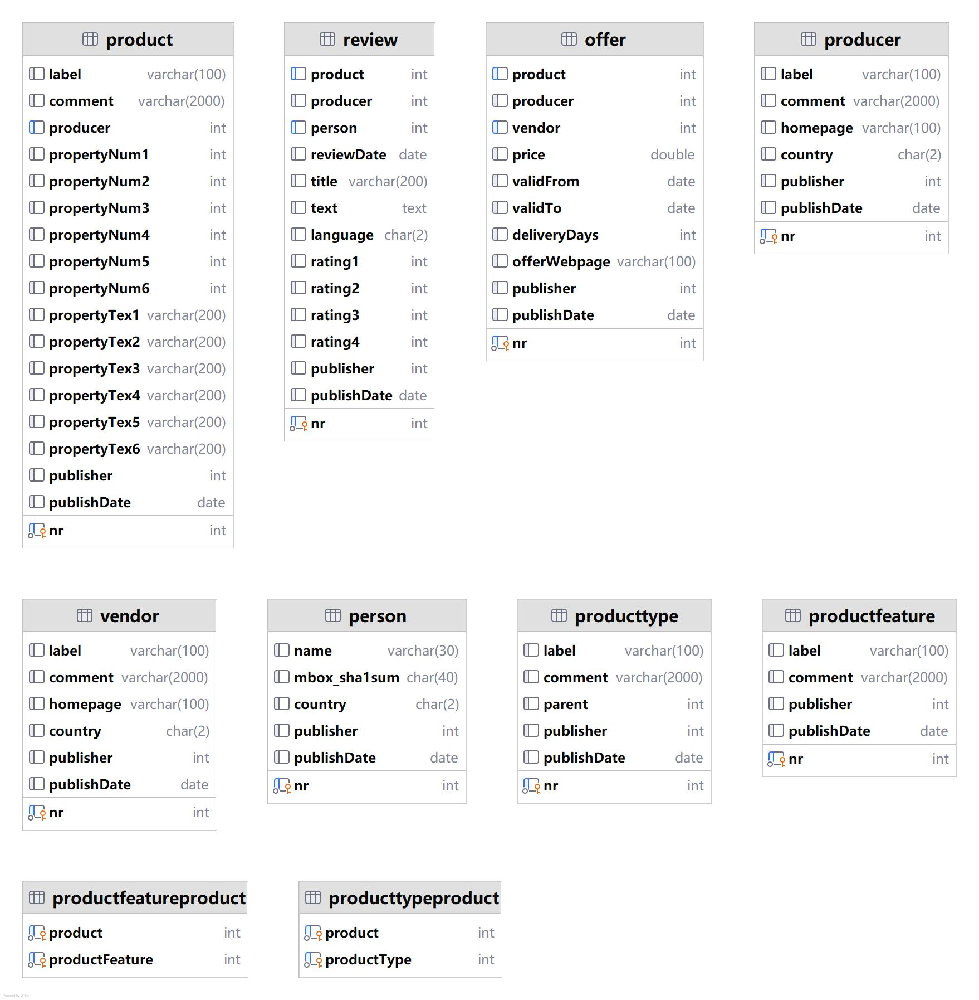
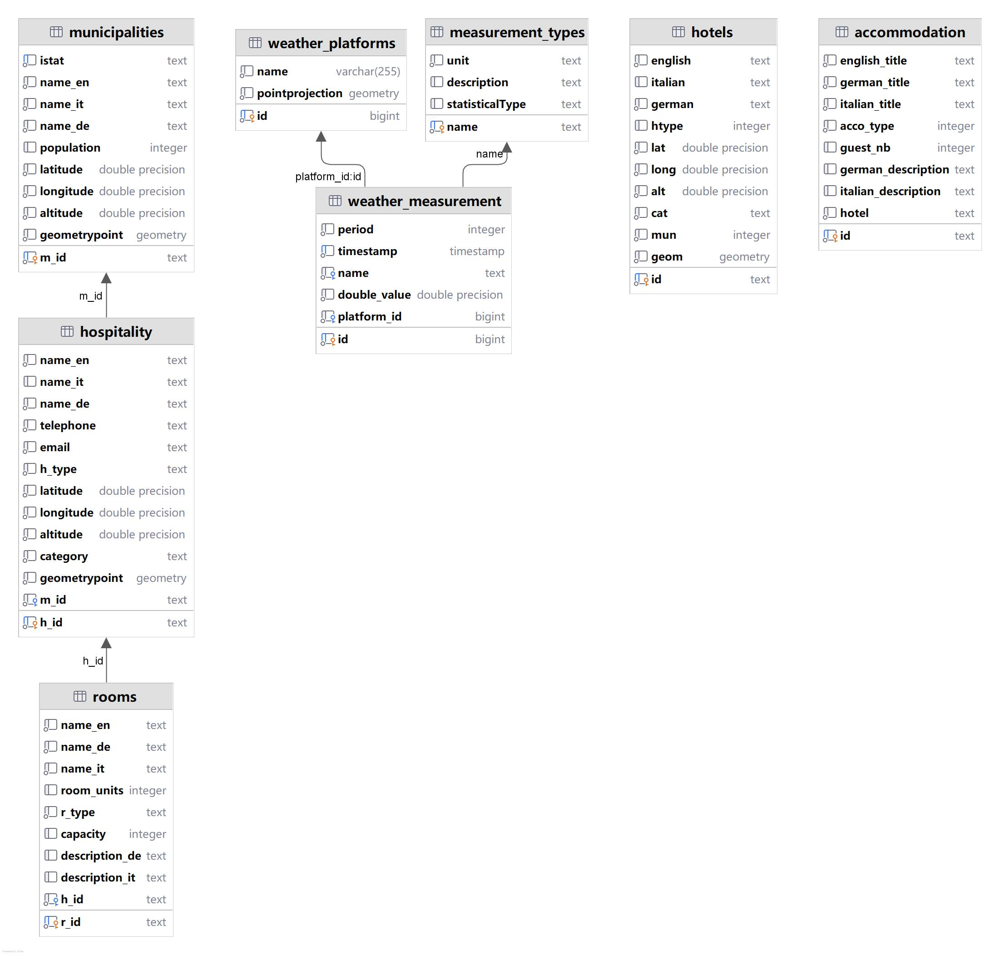
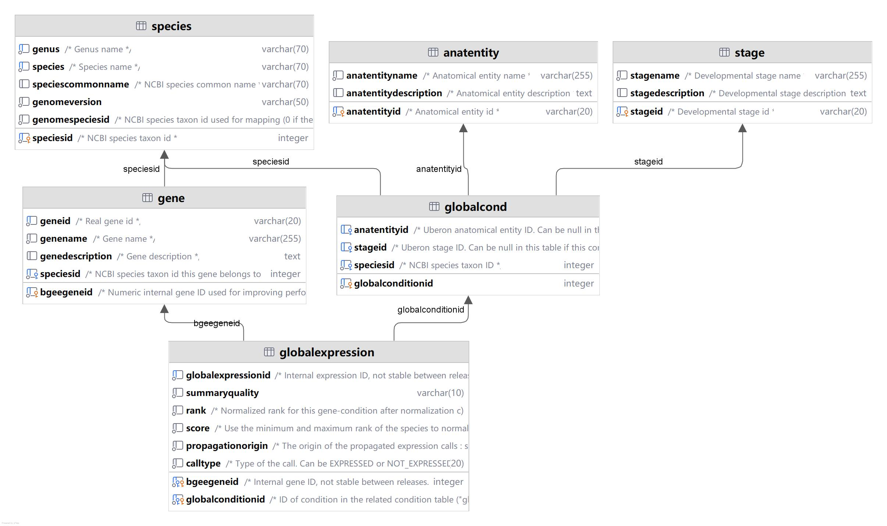
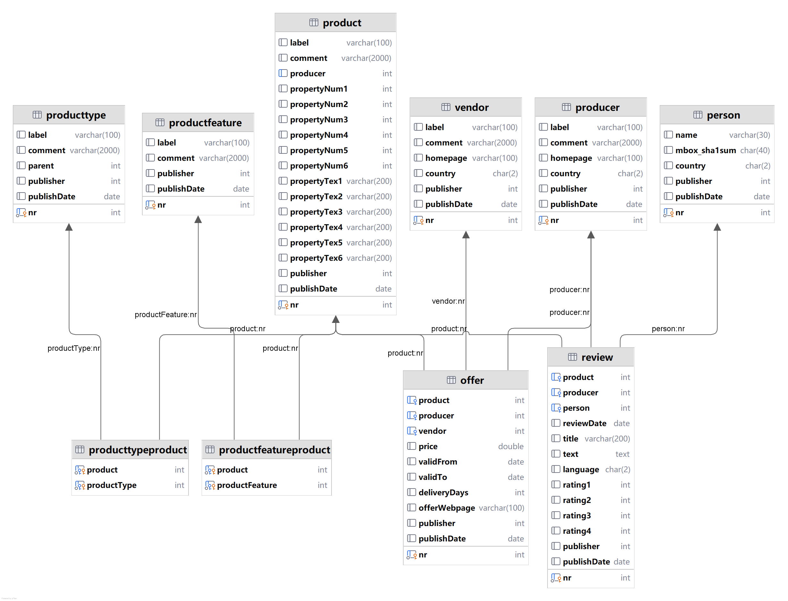

# Introduction
This repository aims to collect publicly available VKG resources.


# python enviroment [optional]
## create conda enviroment
```shell
conda create -n vkg_collection python=3.12
conda activate vkg_collection
pip install -r requirement.txt
```

# VKG Resources
see `vkg_resources.xlsx` and `./vkgs`

# Introduction of VKGs
## [NPD](./vkgs/npd)
The NPD benchmark is a benchmark specifically designed for OBDA systems. An OBDA system is a system that separates the user from the physical data source(s) by means of a conceptual view of the data which provides the user with a convenient vocabulary.

[source project](https://github.com/ontop/npd-benchmark/tree/master)

[npd-benchmark](https://ontop-vkg.org/npd-benchmark/)

The ER diagram of the database is as follows:


## [UOBM](./vkgs/uobm)
Beyond OWL 2 QL in OBDA: Rewritings and Approximations. Elena Botoeva, Diego Calvanese, Valerio Santarelli, Domenico F. Savo, Alessandro Solimando, and Guohui Xiao

[source project](https://github.com/ontop/ontop-examples/tree/master/aaai-2016-ontoprox/uobm)

The ER diagram of the database is as follows:



## [dest](./vkgs/dest)
This tutorial is adapted from the Virtual Knowledge Graph of the South Tyrolean Open Data Hub.

[source project](https://github.com/ontopic-vkg/destination-tutorial/tree/master)

The ER diagram of the database is as follows:



## [Bgee](./vkgs/easybgee_v14_2)
An Ontop tutorial using the Bgee database

[source project](https://github.com/ontop/ontop-patterns-tutorial/tree/main)

The ER diagram of the database is as follows:



## [BSBM](./vkgs/bsbm)
The SPARQL Query Language for RDF and the SPARQL Protocol for RDF are implemented by a growing number of storage systems and are used within enterprise and open web settings. As SPARQL is taken up by the community there is a growing need for benchmarks to compare the performance of storage systems that expose SPARQL endpoints via the SPARQL protocol. Such systems include native RDF stores, Named Graph stores, systems that map relational databases into RDF, and SPARQL wrappers around other kinds of data sources.

The Berlin SPARQL Benchmark (BSBM) defines a suite of benchmarks for comparing the performance of these systems across architectures. The benchmark is built around an e-commerce use case in which a set of products is offered by different vendors and consumers have posted reviews about products. The benchmark query mix illustrates the search and navigation pattern of a consumer looking for a product.

[source project](https://github.com/ontop/ontop-examples/tree/master/dke-2022-mapping-patterns/scenarios/bsbm)

[data link](http://wbsg.informatik.uni-mannheim.de/bizer/berlinsparqlbenchmark/V1/results/index.html)

The ER diagram of the database is as follows:



[//]: # (# raw vkg resources)

[//]: # (## [ontop-examples]&#40;https://github.com/ontop/ontop-examples/tree/master&#41;)

[//]: # ()
[//]: # (## [RODI]&#40;https://github.com/chrpin/rodi&#41;)

[//]: # ()
[//]: # (## BSBM)

[//]: # (http://wbsg.informatik.uni-mannheim.de/bizer/berlinsparqlbenchmark/V1/results/index.html)

[//]: # ()
[//]: # (## DBLP)

[//]: # (https://github.com/kite1988/dblp-parser/blob/master/ReadMe.md)

[//]: # (https://dataconverter.io/convert/xml-to-mysql)

[//]: # (https://github.com/calledit/xml2rDB)

[//]: # ()
[//]: # (## others)

[//]: # (https://github.com/ghxiao/city-bench/tree/master)
[//]: # ()
[//]: # ()
[//]: # (⭐⭐⭐ https://github.com/ontop/ontop-patterns-tutorial/tree/main)