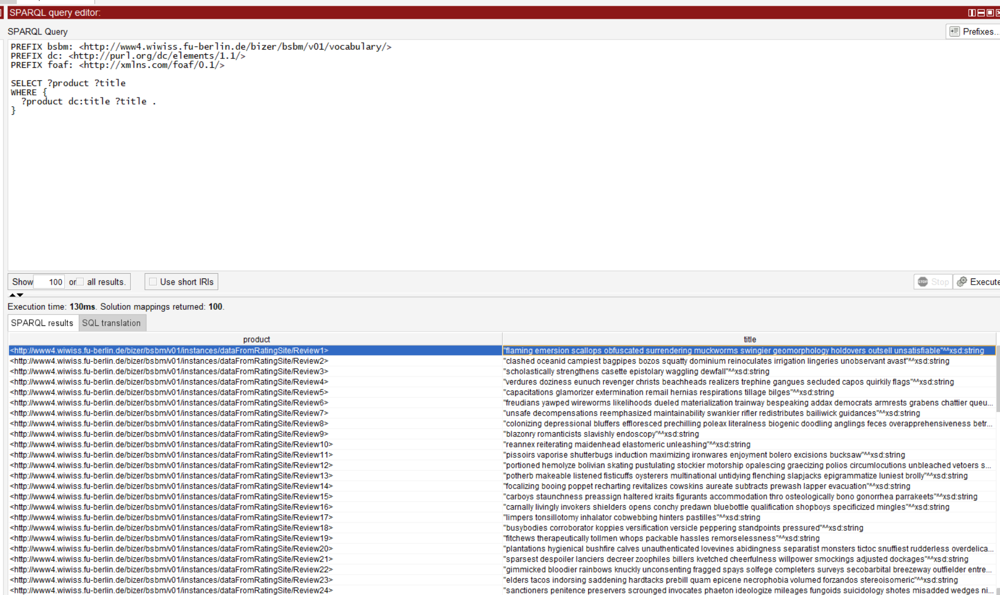

# Supplemental materials for the AAAI 2016 paper

- **Beyond OWL 2 QL in OBDA: Rewritings and Approximations**. 
  Elena Botoeva, Diego Calvanese, Valerio Santarelli, Domenico F. Savo, Alessandro Solimando, and Guohui Xiao

The UOBM scenario used in the paper is provided in the [uobm](https://github.com/ontop/ontop-examples/tree/master/aaai-2016-ontoprox/uobm) directory.

# Deployment Steps
## Install docker
install docker
```shell
sudo apt update
sudo apt install -y ca-certificates curl gnupg lsb-release
sudo mkdir -p /etc/apt/keyrings
curl -fsSL https://download.docker.com/linux/ubuntu/gpg | sudo gpg --dearmor -o /etc/apt/keyrings/docker.gpg
echo "deb [arch=$(dpkg --print-architecture) signed-by=/etc/apt/keyrings/docker.gpg] https://download.docker.com/linux/ubuntu $(lsb_release -cs) stable" | sudo tee /etc/apt/sources.list.d/docker.list > /dev/null
sudo apt install -y docker-ce docker-ce-cli containerd.io docker-compose-plugin
```
check
```shell
sudo docker run hello-world
```
You will see information below if successful:
```text
Hello from Docker!
This message shows that your installation appears to be working correctly.
```
## Install mysql
install mysql using docker
```shell
docker pull mysql:latest
```
run mysql
```shell
docker run --name mysql-container -e MYSQL_ROOT_PASSWORD=root -d -p 3306:3306 mysql:latest
```
- --name mysql-container: Names your container
- -e MYSQL_ROOT_PASSWORD=your_password: Sets the root password
- -d: Runs the container in detached mode (background)
- -p 3306:3306: Maps the container's MySQL port to your host
- mysql:latest: Specifies the image to use

check
```shell
docker ps
```
You will see information below if successful:
```text
id   mysql:latest   "docker-entrypoint.s…"   12 seconds ago   Up 11 seconds   0.0.0.0:3306->3306/tcp, [::]:3306->3306/tcp, 33060/tcp   mysql-container
```
Get into mysql (the password is setted by `MYSQL_ROOT_PASSWORD=your_password`)
```shell
docker run -it --network host mysql:latest mysql -h127.0.0.1 -uroot -p
```

## create bsbm dataset
```shell
CREATE DATABASE d2r;
```

## Load bsbm dataset
```shell
mysql -h 127.0.0.1 -P 3306 -u root -p < 01ProductFeature.sql
mysql -h 127.0.0.1 -P 3306 -u root -p < 02ProductType.sql
mysql -h 127.0.0.1 -P 3306 -u root -p < 03Producer.sql
mysql -h 127.0.0.1 -P 3306 -u root -p < 04Product.sql
mysql -h 127.0.0.1 -P 3306 -u root -p < 05ProductTypeProduct.sql
mysql -h 127.0.0.1 -P 3306 -u root -p < 06ProductFratureProduct.sql
mysql -h 127.0.0.1 -P 3306 -u root -p < 07Vendor.sql
mysql -h 127.0.0.1 -P 3306 -u root -p < 08Offer.sql
mysql -h 127.0.0.1 -P 3306 -u root -p < 09Person.sql
mysql -h 127.0.0.1 -P 3306 -u root -p < 10Review.sql
```
check
```shell
# 1. get into 
mysql -h 127.0.0.1 -P 3306 -uroot -p
# 2. change database
USE d2r;   #remember database name is d2r not bsbm
# 3. check data
SELECT * FROM offer LIMIT 5;
```
You will see information below if successful:
```text
+----+---------+----------+--------+-------------------+------------+------------+--------------+----------------------------------------------------------------------------------+-----------+-------------+
| nr | product | producer | vendor | price             | validFrom  | validTo    | deliveryDays | offerWebpage                                                                     | publisher | publishDate |
+----+---------+----------+--------+-------------------+------------+------------+--------------+----------------------------------------------------------------------------------+-----------+-------------+
|  1 |      40 |        1 |      1 | 9272.007354110221 | 2008-03-17 | 2008-08-29 |            5 | http://www4.wiwiss.fu-berlin.de/bizer/bsbm/v01/instances/dataFromVendor1/Offer1/ |         1 | 2008-05-31  |
|  2 |      30 |        1 |      1 | 6956.919934053504 | 2008-04-19 | 2008-07-29 |            3 | http://www4.wiwiss.fu-berlin.de/bizer/bsbm/v01/instances/dataFromVendor1/Offer2/ |         1 | 2008-05-06  |
|  3 |      43 |        1 |      1 | 9089.560318593778 | 2008-04-23 | 2008-06-29 |            4 | http://www4.wiwiss.fu-berlin.de/bizer/bsbm/v01/instances/dataFromVendor1/Offer3/ |         1 | 2008-05-30  |
|  4 |      62 |        2 |      1 | 5785.551688541885 | 2008-04-05 | 2008-07-06 |            3 | http://www4.wiwiss.fu-berlin.de/bizer/bsbm/v01/instances/dataFromVendor1/Offer4/ |         1 | 2008-04-17  |
|  5 |      48 |        1 |      1 | 2237.247350018178 | 2008-01-19 | 2008-07-06 |            5 | http://www4.wiwiss.fu-berlin.de/bizer/bsbm/v01/instances/dataFromVendor1/Offer5/ |         1 | 2008-04-15  |
+----+---------+----------+--------+-------------------+------------+------------+--------------+----------------------------------------------------------------------------------+-----------+-------------+
5 rows in set (0.00 sec)

```

## Configure MySQL Connection
Modify the configuration in `bsbm.properties`

## Deploy VKG
**Ensure you have downloaded [ontop-protege-bundle](https://github.com/ontop/ontop/releases).**

**Ensure you have opened ontop tabs (protege → Window → Tabs → Ontop SPARQL & Ontop Mappings)**

You will see information below if successful:


Now start to deploy and check the VKG: 
1. Open the ontology file `bsbm.owl` (protege → File → Open)
2. Select the Ontop Reasoner (protege → Reasoner → Ontop)
3. Start the Ontop Reasoner (protege → Reasoner → Start reasoner)
4. Wait till `Reasoner active` is shown in the Protege's bottom right corner


5. Execute a SPARQL sample to check if the VKG is working (in tab **Ontop SPARQL**):
```text
PREFIX bsbm: <http://www4.wiwiss.fu-berlin.de/bizer/bsbm/v01/vocabulary/>
PREFIX dc: <http://purl.org/dc/elements/1.1/>
PREFIX foaf: <http://xmlns.com/foaf/0.1/>

SELECT ?product ?title
WHERE {
  ?product dc:title ?title .
}
```

**You will see information below if successful:**
