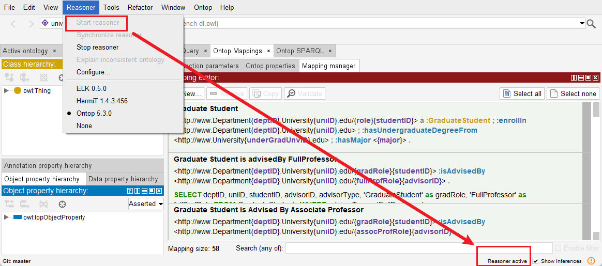

# An Ontop tutorial using the Bgee database
https://github.com/ontop/ontop-patterns-tutorial/tree/main
## Statistic
### Ontology
#Class: 32

#Object Property: 23

#Data Property: 6

#Individual: 10

### Database
#Table: 6

#Cloumn: 29

#Row: 97474

# Deployment Steps
## Install docker
install docker
```shell
sudo apt update
sudo apt install -y ca-certificates curl gnupg lsb-release
sudo mkdir -p /etc/apt/keyrings
curl -fsSL https://download.docker.com/linux/ubuntu/gpg | sudo gpg --dearmor -o /etc/apt/keyrings/docker.gpg
echo "deb [arch=$(dpkg --print-architecture) signed-by=/etc/apt/keyrings/docker.gpg] https://download.docker.com/linux/ubuntu $(lsb_release -cs) stable" | sudo tee /etc/apt/sources.list.d/docker.list > /dev/null
sudo apt install -y docker-ce docker-ce-cli containerd.io docker-compose-plugin
```
check
```shell
sudo docker run hello-world
```
You will see information below if successful:
```text
Hello from Docker!
This message shows that your installation appears to be working correctly.
```
## Install postgresSQL
install postgresSQL using docker
```shell
docker pull postgres
```
run postgres
```shell
docker run --name my-postgres -e POSTGRES_PASSWORD=root -p 5432:5432 -d postgres
```
- --name mysql-container: Names your container
- -e POSTGRES_PASSWORD=your_password: Sets the root password
- -d: Runs the container in detached mode (background)
- -p 5432:5432: Maps the container's postgresSQL port to your host
- postgres: Specifies the image to use

## Load NPD dataset
**Create NPD database**
1. Login into postgresSQL
```text
psql -h 127.0.0.1 -p 5432 -U postgres 
```
2. Create database
```text
CREATE DATABASE easybgee_v14_2;
```
3. Quit postgresSQL
```text
\q
```

**Load data**

```shell
psql -h 127.0.0.1 -p 5432 -U postgres -d easybgee_v14_2 -f postgresql_ontop_tutorial.sql
```
**check**
```shell
# 1. get into 
psql -h 127.0.0.1 -p 5432 -U postgres -d easybgee_v14_2
# 2. check data
\dt
# 3. quit
enter q
```

You will see information below if successful:
```text
              List of relations
 Schema |       Name       | Type  |  Owner   
--------+------------------+-------+----------
 public | anatentity       | table | postgres
 public | gene             | table | postgres
 public | globalcond       | table | postgres
 public | globalexpression | table | postgres
 public | species          | table | postgres
 public | stage            | table | postgres
```

## Configure Database Connection
Modify the configuration in `bgee_v14_genex.properties`

## Deploy VKG
**Ensure you have downloaded [ontop-protege-bundle](https://github.com/ontop/ontop/releases).**

**Ensure you have opened ontop tabs (protege → Window → Tabs → Ontop SPARQL & Ontop Mappings)**

You will see information below if successful:


Now start to deploy and check the VKG: 
1. Open the ontology file `bgee_v14_genex.ttl` (protege → File → Open)
2. Select the Ontop Reasoner (protege → Reasoner → Ontop)
3. Start the Ontop Reasoner (protege → Reasoner → Start reasoner)
4. Wait till `Reasoner active` is shown in the Protege's bottom right corner



5. Execute a SPARQL sample to check if the VKG is working (in tab **Ontop SPARQL**):
```text
PREFIX orth: <http://purl.org/net/orth#>
PREFIX rdfs: <http://www.w3.org/2000/01/rdf-schema#>
PREFIX dcterms: <http://purl.org/dc/terms/>

SELECT ?gene_name ?gene_description ?gene_page {
   VALUES ?gene_name {"boss"}
   ?gene a orth:Gene ; 
      rdfs:seeAlso ?gene_page ;
      dcterms:description ?gene_description ;  
      rdfs:label ?gene_name .
}
```

**You will see information below if successful:**

