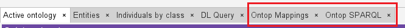

# Supplemental materials for the AAAI 2016 paper

- **Beyond OWL 2 QL in OBDA: Rewritings and Approximations**. 
  Elena Botoeva, Diego Calvanese, Valerio Santarelli, Domenico F. Savo, Alessandro Solimando, and Guohui Xiao

The UOBM scenario used in the paper is provided in the [uobm](https://github.com/ontop/ontop-examples/tree/master/aaai-2016-ontoprox/uobm) directory.

# Deployment Steps
## Install docker
install docker
```shell
sudo apt update
sudo apt install -y ca-certificates curl gnupg lsb-release
sudo mkdir -p /etc/apt/keyrings
curl -fsSL https://download.docker.com/linux/ubuntu/gpg | sudo gpg --dearmor -o /etc/apt/keyrings/docker.gpg
echo "deb [arch=$(dpkg --print-architecture) signed-by=/etc/apt/keyrings/docker.gpg] https://download.docker.com/linux/ubuntu $(lsb_release -cs) stable" | sudo tee /etc/apt/sources.list.d/docker.list > /dev/null
sudo apt install -y docker-ce docker-ce-cli containerd.io docker-compose-plugin
```
check
```shell
sudo docker run hello-world
```
You will see information below if successful:
```text
Hello from Docker!
This message shows that your installation appears to be working correctly.
```
## Install mysql
install mysql using docker
```shell
docker pull mysql:latest
```
run mysql
```shell
docker run --name mysql-container -e MYSQL_ROOT_PASSWORD=root -d -p 3306:3306 mysql:latest
```
- --name mysql-container: Names your container
- -e MYSQL_ROOT_PASSWORD=your_password: Sets the root password
- -d: Runs the container in detached mode (background)
- -p 3306:3306: Maps the container's MySQL port to your host
- mysql:latest: Specifies the image to use

check
```shell
docker ps
```
You will see information below if successful:
```text
id   mysql:latest   "docker-entrypoint.s…"   12 seconds ago   Up 11 seconds   0.0.0.0:3306->3306/tcp, [::]:3306->3306/tcp, 33060/tcp   mysql-container
```
Get into mysql (the password is setted by `MYSQL_ROOT_PASSWORD=your_password`)
```shell
docker run -it --network host mysql:latest mysql -h127.0.0.1 -uroot -p
```
## Load UOBM dataset
```shell
mysql -h 127.0.0.1 -P 3306 -u root -p < uobm.sql
```
check
```shell
# 1. get into 
mysql -h 127.0.0.1 -P 3306 -uroot -p
# 2. change database
USE uobm;
# 3. check data
SELECT * FROM Authors LIMIT 10;
```
You will see information below if successful:
```text
+----+--------+-------+--------------------+-------+
| ID | deptID | uniID | role               | pubID |
+----+--------+-------+--------------------+-------+
|  0 |      0 |     0 | AssistantProfessor |   114 |
|  0 |      0 |     0 | AssistantProfessor |   153 |
|  0 |      0 |     0 | AssistantProfessor |   204 |
|  0 |      0 |     0 | AssistantProfessor |   205 |
|  0 |      0 |     0 | AssistantProfessor |   206 |
|  0 |      0 |     0 | AssistantProfessor |   207 |
|  0 |      0 |     0 | AssistantProfessor |   208 |
|  0 |      0 |     0 | AssistantProfessor |   209 |
|  0 |      0 |     0 | AssociateProfessor |    58 |
|  0 |      0 |     0 | AssociateProfessor |    87 |
+----+--------+-------+--------------------+-------+
10 rows in set (0.01 sec)
```

## Configure MySQL Connection
Modify the configuration in `univ-bench-dl.properties`

## Deploy VKG
**Ensure you have downloaded [ontop-protege-bundle](https://github.com/ontop/ontop/releases).**

**Ensure you have opened ontop tabs (protege → Window → Tabs → Ontop SPARQL & Ontop Mappings)**

You will see information below if successful:


Open the ontology file `univ-bench-dl.owl` (protege → File → Open)

